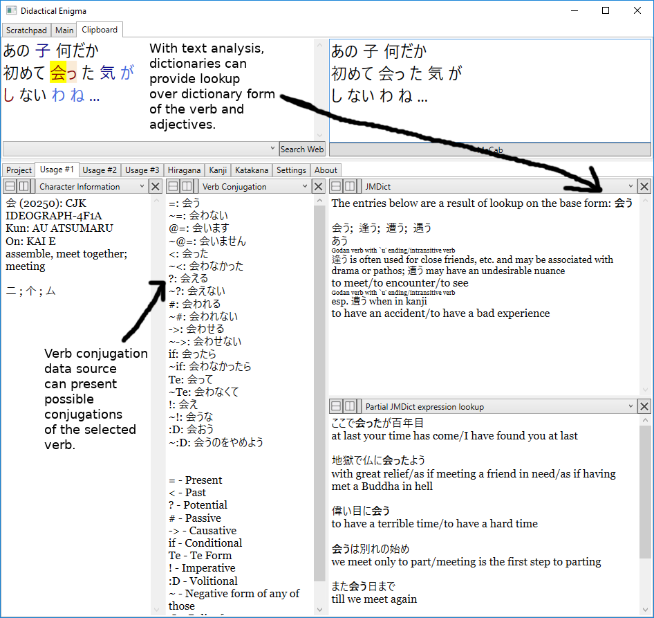
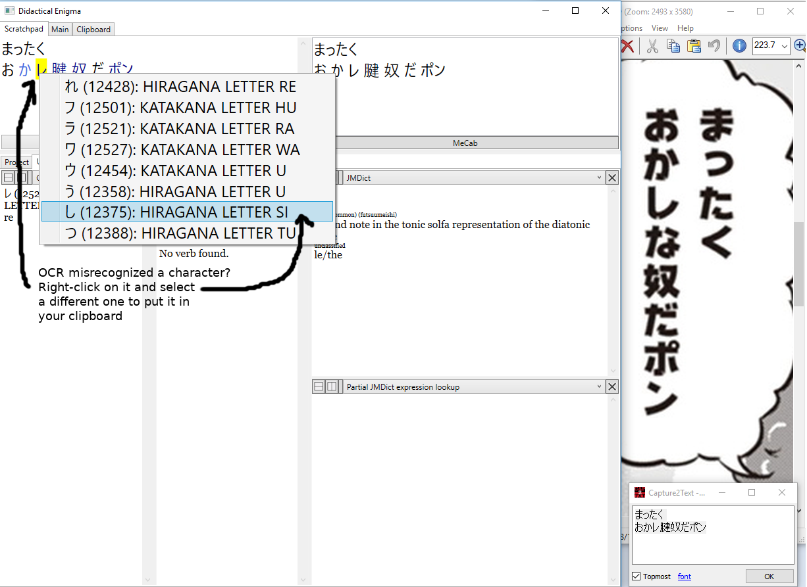

Starting up the program (DidacticalEnigma.exe) for the first time takes 1-2 minutes, and the program will take up to 1GB of disk space.

Yomichan-import program is available [here](https://github.com/FooSoft/yomichan-import)

