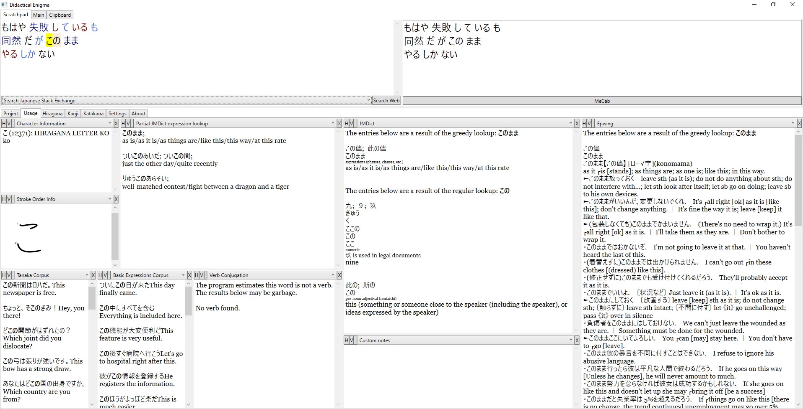
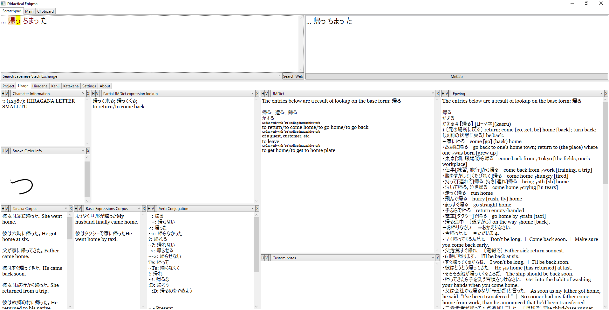
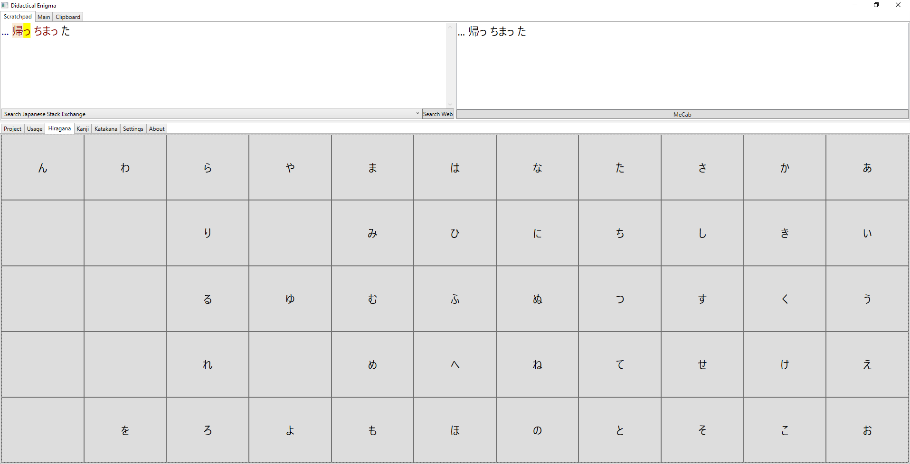
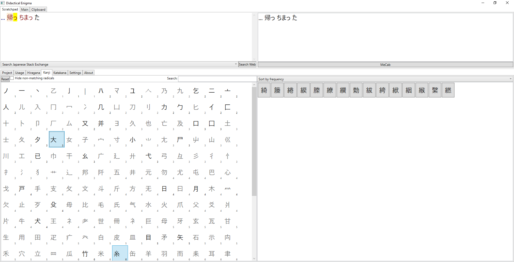

Didactical Enigma 
=================

This tool's goal is to assist in translation from Japanese to English.

Interface
---------

Data sources
------------

Note that while the source code itself is MIT licensed, this program uses the following data sources:

- NMeCab project (LGPL):
    https://osdn.net/projects/nmecab
- JMdict project ([Terms of Use](http://www.edrdg.org/edrdg/licence.html)):
    http://www.edrdg.org/wiki/index.php/JMdict-EDICT_Dictionary_Project
- KRADFILE/RADKFILE ([Terms of Use](http://www.edrdg.org/edrdg/licence.html)):
    http://www.edrdg.org/krad/kradinf.html
- Resources available from the following wikipedia pages ([Terms of Use](https://en.wikipedia.org/wiki/Wikipedia:Text_of_Creative_Commons_Attribution-ShareAlike_3.0_Unported_License)):
    https://en.wiktionary.org/wiki/Appendix:Easily_confused_Japanese_kana (accessed 28.07.2018)

    https://en.wikipedia.org/wiki/Hiragana

    https://en.wikipedia.org/wiki/Katakana

Name...?
--------

The name was merged from two different autogenerated names from GitHub's "new repository" page. 

A little backstory: I picked up translating even though I had no clue about Japanese writing system, because it was a real-life motivation for me to actually learn Japanese. Having one of the sites I was relying on being offline for 3 days, and needing to cross check across 10 different browser pages made me consider unifying my workflow in a single program. 

Hence: "didactical" because it's a learning experience (both using and writing the program) and "enigma" because translating without knowing the language is sort of like deciphering Enigma ciphertexts.

Contributing
------------

This program is written by a total amateur. Advice from people who know Japanese is highly welcome!