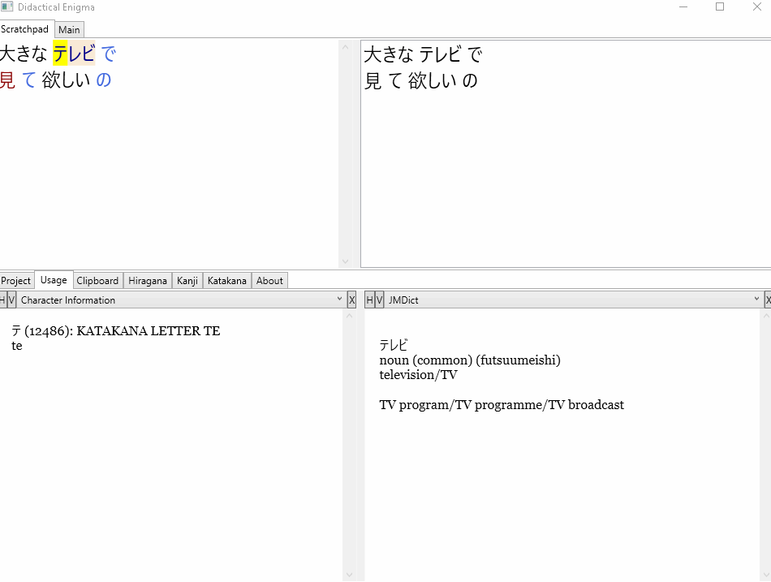
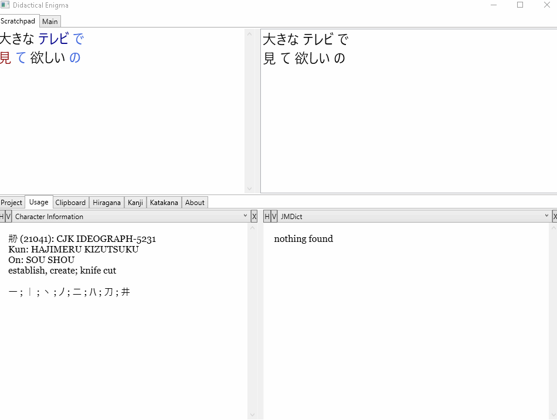
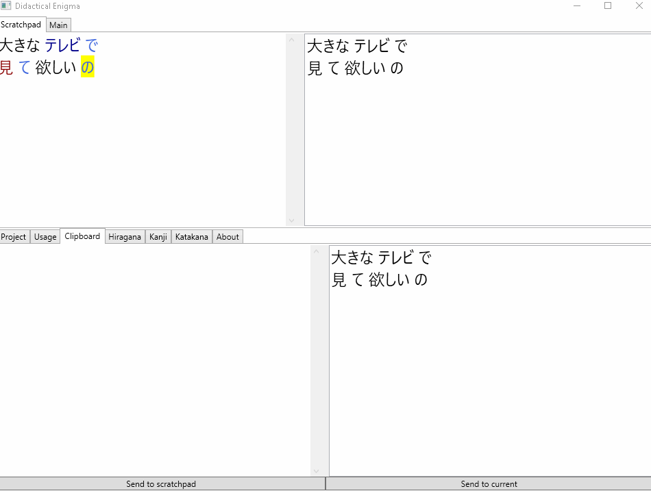
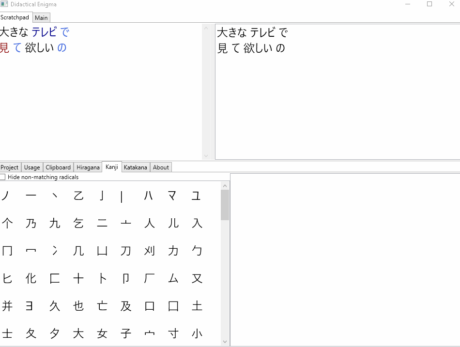

Didactical Enigma
=================

This tool's goal is to assist in translation from Japanese to English.

Interface
---------

Data sources
------------

Note that while the source code itself is MIT licensed, this program uses the following data sources:

- NMeCab project (LGPL):
    https://osdn.net/projects/nmecab
- JMdict project ([Terms of Use](http://www.edrdg.org/edrdg/licence.html)):
    http://www.edrdg.org/wiki/index.php/JMdict-EDICT_Dictionary_Project
- KRADFILE/RADKFILE ([Terms of Use](http://www.edrdg.org/edrdg/licence.html)):
    http://www.edrdg.org/krad/kradinf.html
- Resources available from the following wikipedia pages ([Terms of Use](https://en.wikipedia.org/wiki/Wikipedia:Text_of_Creative_Commons_Attribution-ShareAlike_3.0_Unported_License):
    https://en.wiktionary.org/wiki/Appendix:Easily_confused_Japanese_kana (accessed 28.07.2018)
    https://en.wikipedia.org/wiki/Hiragana
    https://en.wikipedia.org/wiki/Katakana
